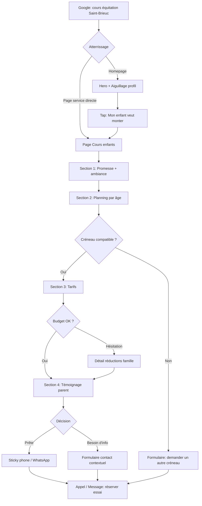
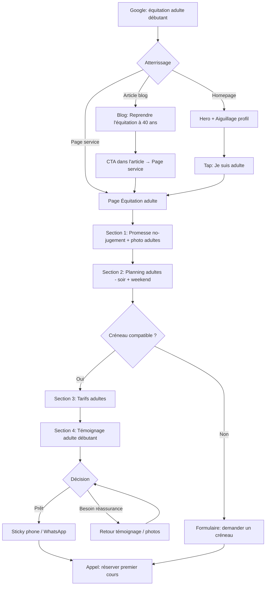
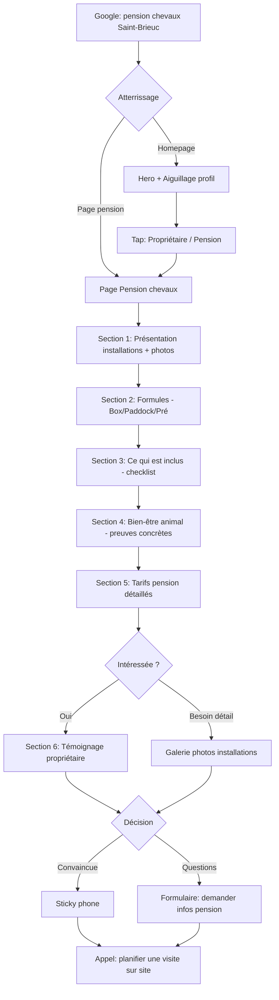
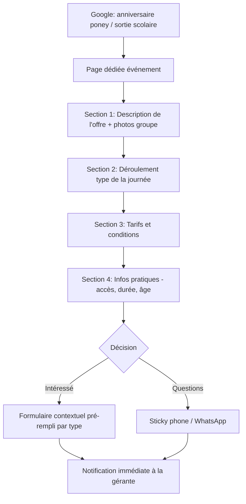
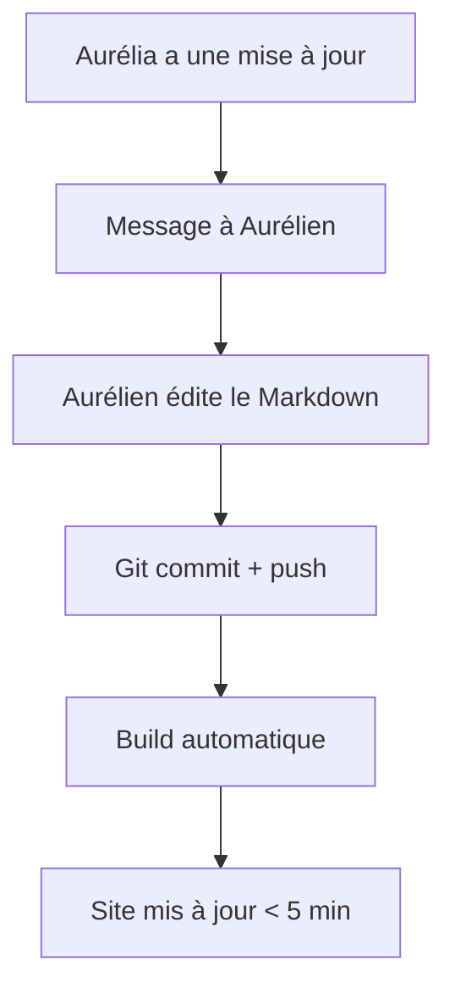
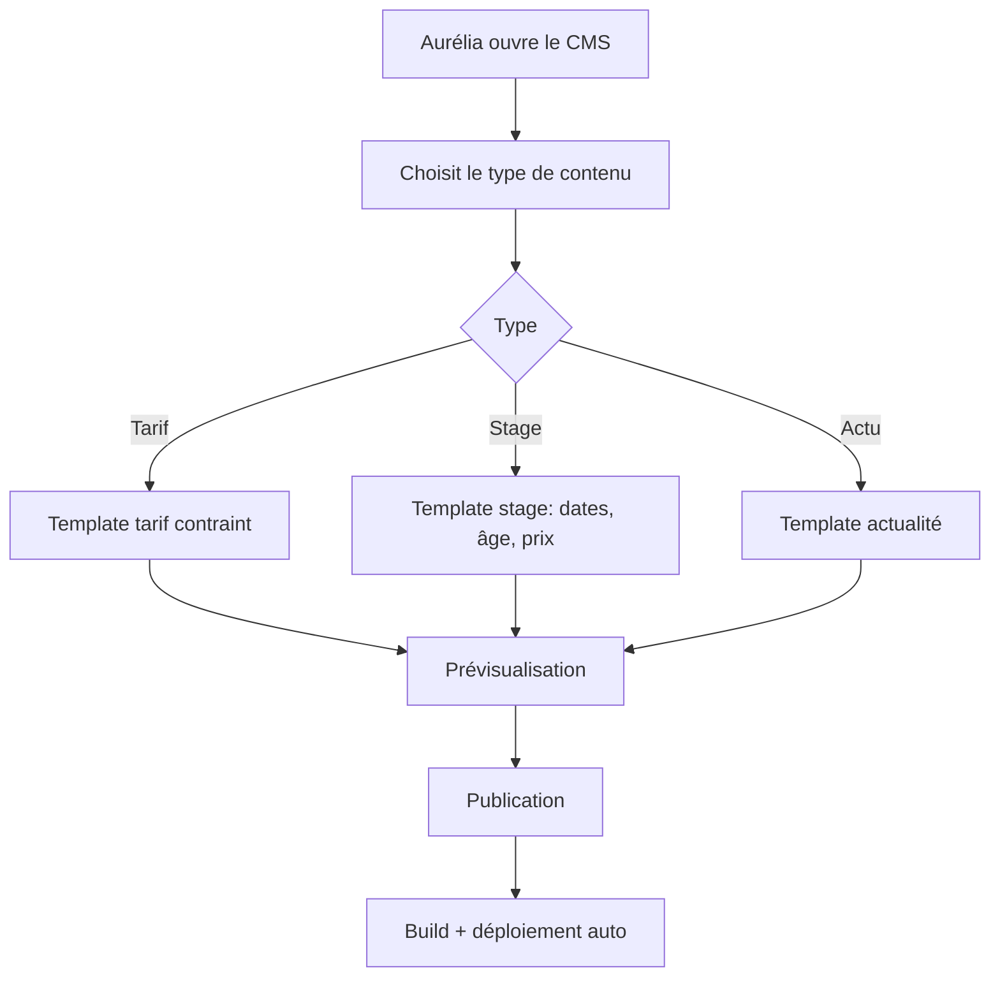

# UX Design Specification equi-22

**Author:** Aurélien
**Date:** 2026-02-13

---

## Executive Summary

### Project Vision

Équi 22 est un centre équestre familial à Yffiniac (Côtes-d'Armor) qui offre un écosystème complet de 6 pôles d'activité : enseignement, compétition, pensions/demi-pensions, stages/balades, élevage (Bihan Braz), et vente/dépôt-vente de chevaux. Le centre est porté par une philosophie de bienveillance, de transparence et de respect animal.

Le site web doit rendre visible cette richesse actuellement invisible en ligne, en devenant le leader SEO local sur le bassin Saint-Brieuc / Lamballe / Yffiniac. Chaque page doit servir deux objectifs : capturer du trafic organique sur une requête précise, et convertir le visiteur en appel téléphonique ou message WhatsApp.

L'approche UX repose sur trois piliers :
- **Clarté immédiate** — Chaque persona trouve son chemin, ses tarifs et le contact en quelques secondes
- **Narration émotionnelle** — Le site raconte l'histoire du centre à travers ses cavaliers, pas à travers ses services
- **Transparence totale** — Tarifs, inclusions, planning : tout est visible, sans surprise

### Target Users

**Personas primaires :**

| Persona | Besoin fondamental | Déclencheur émotionnel | Canal de conversion |
|---------|-------------------|----------------------|-------------------|
| Sophie (parent) | Cours sécurisés, prix clairs, planning compatible | "Ma fille veut monter à cheval" | Téléphone / WhatsApp |
| Marc (adulte) | Environnement sans jugement, permission de commencer | "Et si je m'y remettais ?" | Téléphone / WhatsApp |
| Claire (propriétaire) | Installations, bien-être animal, transparence tarifs | Insatisfaction pension actuelle | Téléphone (visite sur site) |

**Personas secondaires :**

| Persona | Besoin fondamental | Spécificité UX |
|---------|-------------------|---------------|
| Visiteurs événementiels | Anniversaire poney, sortie scolaire, team-building | Landing pages autonomes par événement |
| Éleveurs | Saillie, réservation poulain, génétique | Contenu très technique, fiches étalons détaillées |
| Acheteurs/vendeurs | Trouver ou vendre un cheval, dépôt-vente | Transparence des conditions, confiance |
| Aurélia (gérante) | Mettre à jour tarifs, plannings, actus | V1 via Aurélien, V2 via CMS contraint |

**Contexte d'utilisation :**
- Recherche principalement mobile (parent le dimanche soir, adulte le soir en semaine)
- Connexion variable (4G en zone semi-rurale)
- Niveau tech utilisateurs : grand public, pas technophile
- Multi-canal : les visiteurs découvrent via Google/Facebook, valident sur le site, contactent par téléphone/WhatsApp/SMS

### Key Design Challenges

1. **Complexité informationnelle vs. clarté immédiate** — 6 pôles d'activité, des dizaines de tarifs structurés (par formule, par animal, par distance concours), un planning par jour et par niveau. Le défi : offrir la profondeur de contenu sans noyer la surface. Chaque persona doit atteindre son information clé en 2 interactions maximum.

2. **Architecture de navigation pour 6 pôles** — Le menu doit rester à 5-7 entrées maximum malgré la couverture de 6 pôles et de multiples sous-services. Des regroupements intelligents sont nécessaires (ex: élevage + vente sous un même pôle "Chevaux").

3. **Impression de site vivant sur architecture statique** — Les contenus datés de 2021-2023 sur l'ancien site détruisent la confiance. Le design UX doit intégrer des zones de contenu frais (actualités, résultats concours, prochains stages) et rendre les mises à jour faciles même en V1 (Aurélien gère le contenu).

4. **Design sans photos réelles** — La conception utilise des placeholders avec briefs photo précis décrivant l'intention émotionnelle de chaque image. Chaque placeholder spécifie le sujet, l'émotion cible, et le contexte (saison, lieu, personas visibles).

### Design Opportunities

1. **Narration émotionnelle comme levier de conversion** — Aucun concurrent ne raconte d'histoires. Le contenu existant du centre a déjà un ton chaleureux et familial. Transformer chaque page service en micro-récit (problème du visiteur → découverte du centre → transformation) plutôt qu'en fiche descriptive.

2. **Couverture SEO de niches inexploitées** — Élevage de couleurs, étalons Paint Horse en Bretagne, balades baie de Saint-Brieuc, éthologie, hunter : chaque niche est une porte d'entrée organique que personne ne couvre localement. L'UX doit faire de chaque niche une landing page autonome et convaincante.

3. **Transparence tarifaire radicale** — L'ancien site affiche déjà l'intégralité des tarifs (pensions, saillies, concours par distance, réductions famille). C'est exceptionnel dans le secteur équestre. En faire un avantage UX explicite qui inspire confiance et pré-qualifie les visiteurs avant contact.

## Core User Experience

### Defining Experience

L'expérience fondamentale d'Équi 22 se résume en une phrase : **"Je trouve, je comprends, j'appelle."**

Le visiteur arrive avec un besoin précis (cours, pension, stage, balade, compétition) et doit atteindre l'information à valeur ajoutée — tarif, planning, conditions — puis passer à l'action (téléphone ou WhatsApp) en **1 à 3 interactions maximum**.

Chaque page est conçue comme une réponse directe à une question : "Combien ça coûte ?", "C'est quand ?", "Comment je m'inscris ?". Tout le reste — narration, réassurance, preuves sociales — est au service de cette trajectoire, jamais en travers.

### Platform Strategy

- **Web mobile-first** — Pas d'application native. Le site est un site statique responsive, pensé d'abord pour l'écran de Sophie à 21h en 4G
- **Touch-first** — Boutons dimensionnés pour le pouce (44px minimum), navigation par tap, scroll vertical naturel
- **Aucune fonctionnalité offline** — Le site est consultatif, la conversion se fait par téléphone/WhatsApp
- **Connexion dégradée tolérée** — Architecture statique CDN + images optimisées = chargement fiable même en 4G instable en zone semi-rurale
- **Zéro dépendance JavaScript critique** — Le contenu et la navigation fonctionnent sans JS

### Effortless Interactions

| Interaction | Objectif "sans effort" |
|---|---|
| **Trouver son service** | Le visiteur identifie son chemin (cours, pension, stage...) dès le premier écran, sans scroller |
| **Voir le prix** | Les tarifs sont visibles sur chaque page service, pas cachés dans une page séparée à chercher |
| **Voir le planning** | Le créneau pertinent (par âge, par niveau) est lisible en un coup d'oeil sur la page service |
| **Contacter le centre** | Téléphone sticky + WhatsApp flottant = toujours à portée de pouce, zéro navigation |
| **Être rassuré** | La réassurance est intégrée dans le flux de lecture, pas isolée dans une page "à propos" qu'on ne visite jamais |

**Anti-pattern principal à combattre :** Le mur de texte qui noie l'information à valeur ajoutée. Chaque élément de contenu doit justifier sa présence. Si ça n'aide pas le visiteur à décider ou à agir, ça dégage.

### Critical Success Moments

1. **L'atterrissage (0-3 secondes)** — Le visiteur comprend immédiatement qu'il est au bon endroit et voit le chemin vers son besoin. Si ce moment échoue, tout le reste est inutile.

2. **La découverte du tarif + planning (tap 2)** — Le visiteur trouve le prix et le créneau qui lui convient. C'est le moment de bascule rationnel : "ça rentre dans mon budget et mon emploi du temps."

3. **La réassurance cumulative** — Pas un seul élément déclencheur, mais l'accumulation : prix transparent + photos authentiques + témoignage pertinent + ton bienveillant. C'est cette convergence qui transforme l'intérêt en confiance.

4. **Le passage à l'action (tap 3)** — Le bouton d'appel ou WhatsApp est là, visible, évident. Zéro friction entre la décision et le contact.

### Experience Principles

1. **Clarté radicale** — Chaque page répond à une question. Chaque section a une raison d'être. Si un contenu ne sert ni l'information ni la conversion, il est supprimé.

2. **1-3 taps vers l'action** — De l'arrivée au contact, jamais plus de 3 interactions. C'est la règle d'or qui guide toute l'architecture de navigation.

3. **La réassurance est tissée, pas empilée** — Les témoignages, les photos, le ton bienveillant sont intégrés dans le parcours naturel de lecture, pas regroupés dans une page dédiée que personne ne visite.

4. **Le contenu respire** — Anti-mur de texte. L'information à valeur ajoutée (prix, planning, contact) est mise en avant visuellement. Le contexte et la narration l'accompagnent sans la noyer.

5. **Le contact est omniprésent** — Le téléphone et WhatsApp ne sont jamais à plus d'un tap, quelle que soit la page, quel que soit le scroll.

## Desired Emotional Response

### Primary Emotional Goals

**L'émotion signature d'Équi 22 : "Ici, on est bien accueilli — chevaux comme cavaliers."**

Le site doit transmettre trois sentiments fondamentaux, dans cet ordre :

1. **Chaleur familiale** — "C'est sympa et accueillant ici" — Dès les premières secondes, le visiteur ressent la bonne humeur et l'ambiance bienveillante du centre. Pas un site corporate froid, pas un site amateur brouillon : un site qui a de la personnalité et du sourire.

2. **Accessibilité rassurante** — "C'est abordable et c'est pour moi" — Les tarifs transparents, le ton sans jargon élitiste, les formules adaptées à chaque profil : tout dit "venez comme vous êtes, il y a une place pour vous."

3. **Confiance ancrée** — "Les gens ont aimé, les chevaux sont bien traités" — Les témoignages, les photos de chevaux au paddock, le détail des soins : la preuve que le discours n'est pas que des mots.

### Emotional Journey Mapping

| Étape du parcours | Émotion cible | Ce qui la déclenche |
|---|---|---|
| **Atterrissage (0-3s)** | Chaleur + curiosité | Photos authentiques, ton accueillant, design aéré |
| **Exploration service** | Clarté + soulagement | Tarifs visibles, planning lisible, "c'est exactement ce que je cherchais" |
| **Lecture des détails** | Confiance + envie | Témoignages, bien-être animal visible, variété des activités |
| **Passage à l'action** | Détermination + sérénité | Le bouton est là, je sais qui je vais appeler, je sais quoi dire |
| **Erreur / page non trouvée** | Guidé, jamais perdu | Redirection douce vers le bon chemin, ton rassurant "on vous aide" |
| **Retour sur le site** | Familiarité + appartenance | "Mon centre", je retrouve mes repères, je consulte les actus |

### Micro-Emotions

Quatre paires émotionnelles critiques que chaque décision UX doit servir :

| On vise | On combat | Levier UX |
|---|---|---|
| **Confiance** | Confusion | Architecture claire, tarifs visibles, navigation intuitive |
| **Appartenance** | Isolement | Ton familial, photos de groupe, témoignages "des gens comme moi" |
| **Sérénité** | Anxiété | Réassurance parentale (sécurité, diplômes monitrices), photos enfants souriants |
| **Permission** | Jugement | Contenu adultes dédié, "votre rythme, vos objectifs", témoignages adultes débutants |

### Design Implications

| Émotion cible | Choix UX concret |
|---|---|
| **Chaleur familiale** | Ton éditorial décontracté mais professionnel. Photos authentiques (pas de banque d'images). Couleurs chaudes et naturelles évoquant la terre, le bois, la Bretagne |
| **Accessibilité** | Tarifs en évidence sur chaque page service. Langage simple, pas de jargon FFE non expliqué. Formules présentées du plus accessible au plus engagé |
| **Bien-être animal** | Photos des chevaux au pré, au paddock, en liberté. Détails concrets (matelas de box, foin à volonté, ostéopathe). Pas de discours vague — des faits |
| **Variété / bonne humeur** | Mise en valeur de la diversité des activités (CSO, hunter, éthologie, balades, baby poney). Photos de groupes qui rient. Ton qui ne se prend pas au sérieux |
| **Guidé, jamais perdu** | Pages 404 chaleureuses avec suggestions. Fil d'Ariane. Boutons de contact toujours visibles comme filet de sécurité |

### Emotional Design Principles

1. **Le sourire d'abord** — Le site doit donner envie de sourire. La bonne humeur du centre transparaît dans chaque photo, chaque titre, chaque micro-interaction. Un visiteur qui sourit est un visiteur qui appelle.

2. **Montrer, pas déclarer** — Ne pas écrire "nous prenons soin de nos chevaux" : montrer les matelas de box, le foin à volonté, les chevaux au pré. Ne pas écrire "ambiance familiale" : montrer les groupes qui rient, le café offert aux parents.

3. **Chaque persona se reconnaît** — Sophie voit des parents détendus et des enfants fiers. Marc voit des adultes de son âge qui s'amusent. Claire voit des installations soignées et des chevaux sereins. Personne ne se sent "pas à sa place."

4. **L'erreur est une occasion d'aider** — Toute impasse (404, recherche sans résultat, formulaire incomplet) est traitée avec bienveillance et propose un chemin alternatif clair. Le site ne gronde jamais.

5. **La transparence crée l'émotion** — Afficher les prix sans filtre, les conditions sans astérisques, les inclusions sans petites lignes : c'est un acte émotionnel autant qu'informatif. Ça dit "on n'a rien à cacher."

## UX Pattern Analysis & Inspiration

### Inspiring Products Analysis

**1. L'Étrier de Paris** — Le grand centre structuré

Centre équestre parisien de référence avec un site qui fait autorité. Ce qui fonctionne :
- **Architecture de navigation claire** — Les activités sont bien catégorisées et accessibles depuis le menu principal sans ambiguïté
- **Crédibilité immédiate** — Le site inspire confiance par sa présentation soignée et professionnelle
- **Pages services dédiées** — Chaque activité a sa propre page avec les informations essentielles

*Ce qu'on retient pour Équi 22 :* La clarté de l'architecture de navigation et la structuration par service. Mais on doit y ajouter ce que l'Étrier ne fait pas assez — la chaleur humaine et l'émotion.

**2. Equitation-Paris** — La vitrine efficace

Site qui sert de portail vers les activités équestres parisiennes. Ce qui fonctionne :
- **Entrée par le besoin** — Le visiteur est orienté selon ce qu'il cherche (cours, stages, événements...)
- **Hiérarchie visuelle claire** — L'information importante est mise en avant, le secondaire reste accessible mais discret
- **Approche orientée conversion** — Chaque page pousse vers une action (contact, inscription)

*Ce qu'on retient pour Équi 22 :* L'orientation par le besoin du visiteur et la hiérarchie d'information. C'est exactement notre principe "1-3 taps vers l'action."

**3. Sheva Pole Equestre (Paris Val-de-Marne)** — L'innovation interactive

Le simulateur d'inscription est une idée remarquable. Ce qui fonctionne :
- **Interactivité engageante** — Le simulateur transforme un processus administratif ennuyeux en expérience ludique
- **Pré-qualification du visiteur** — Le simulateur pose les bonnes questions et oriente vers la bonne formule avant même le contact
- **Réduction de la friction** — Le visiteur arrive au contact déjà informé, le centre reçoit un prospect qualifié

*Ce qu'on retient pour Équi 22 :* L'idée de guider le visiteur vers la bonne formule. Pour le MVP, pas de simulateur technique, mais le principe d'aiguillage par profil en homepage ("Je cherche des cours pour mon enfant / Je suis adulte / Je cherche une pension") remplit le même rôle avec zéro complexité technique.

**4. L'Écrin du Pin** — Le modèle émotionnel

Centre à taille humaine avec un site qui raconte une ambiance. Ce qui fonctionne :
- **Narration par l'atmosphère** — Le site ne vend pas des services, il raconte un lieu de vie. On *sent* le cadre nature, la sérénité, le rapport au cheval
- **Photos comme vecteur émotionnel** — Les images portent autant d'information que le texte — elles montrent l'ambiance avant que le visiteur ne lise un mot
- **Ton chaleureux et personnel** — On sent les gens derrière le centre, pas une structure anonyme
- **Couverture complète sans surcharge** — Cours, pensions, stages sont présentés avec juste ce qu'il faut de détail

*Ce qu'on retient pour Équi 22 :* C'est le modèle le plus proche de ce qu'on veut créer. La chaleur, le cadre nature, l'authenticité. Équi 22 doit faire pareil — en y ajoutant la transparence tarifaire radicale et l'optimisation SEO locale que L'Écrin du Pin ne pousse pas aussi loin.

### Transferable UX Patterns

**Patterns de navigation :**

| Pattern | Inspiré de | Application Équi 22 |
|---|---|---|
| **Menu par service** | L'Étrier de Paris | Menu principal 5-7 entrées max : Cours, Pension, Stages, Compétition, Élevage, Tarifs, Contact |
| **Aiguillage par profil** | Equitation-Paris + Sheva | Homepage : "Je suis parent / adulte / propriétaire" → chemin dédié |
| **Page service autonome** | Tous les 4 | Chaque service = page complète (description + tarifs + planning + témoignage + CTA) |

**Patterns d'interaction :**

| Pattern | Inspiré de | Application Équi 22 |
|---|---|---|
| **Pré-qualification douce** | Sheva (simulateur) | Aiguillage homepage par profil — version légère sans JS complexe |
| **Contact omniprésent** | Equitation-Paris | Sticky phone + WhatsApp flottant sur toutes les pages |
| **Information progressive** | L'Étrier | Résumé visible → détails en scroll ou accordéon pour les tarifs complexes |

**Patterns visuels et émotionnels :**

| Pattern | Inspiré de | Application Équi 22 |
|---|---|---|
| **Narration par l'image** | L'Écrin du Pin | Photos authentiques du centre en hero, pas de banque d'images |
| **Ambiance nature** | L'Écrin du Pin | Palette couleurs terre/bois/vert, photos des prés et de la baie |
| **Crédibilité structurée** | L'Étrier | Diplômes monitrices, labels FFE, avis Google visibles |

### Anti-Patterns to Avoid

| Anti-pattern | Vu où | Pourquoi c'est toxique pour Équi 22 |
|---|---|---|
| **Mur de texte sans hiérarchie** | La majorité des sites équestres | Noie l'information à valeur ajoutée, le visiteur fuit avant de trouver le prix |
| **Tarifs cachés ou "sur demande"** | Nombreux concurrents | Détruit la confiance. Notre transparence est un avantage concurrentiel |
| **Photos datées ou génériques** | Ancien site Équi 22 | Crée un doute : "ce centre est-il encore actif ?" |
| **Navigation labyrinthique** | Sites avec 15+ entrées menu | Sophie perd patience en 5 secondes, elle retourne sur Google |
| **Pas de CTA visible** | Sites vitrines passifs | Le visiteur veut agir mais ne trouve pas comment — il part |
| **Contenu daté visible** | Ancien site ("stages été 2022") | Signal de site abandonné = perte de confiance immédiate |
| **Simulateur trop complexe pour le MVP** | Sheva (à ne pas copier tel quel) | Complexité technique disproportionnée pour le volume d'Équi 22. L'aiguillage par profil suffit |

### Design Inspiration Strategy

**Ce qu'on adopte :**
- L'architecture de navigation claire de l'Étrier (menu par service, pages dédiées)
- La narration émotionnelle et l'ambiance nature de L'Écrin du Pin
- L'orientation par besoin d'Equitation-Paris
- Le principe de pré-qualification de Sheva (version légère : aiguillage par profil)

**Ce qu'on adapte :**
- La sophistication visuelle des sites parisiens → simplifiée pour un centre familial breton (authentique > luxueux)
- Le simulateur de Sheva → réduit à un aiguillage statique par profil en homepage (pas de JS complexe)
- La structure de l'Étrier → allégée pour 6 pôles au lieu de dizaines d'activités

**Ce qu'on évite :**
- Le côté corporate froid des grands centres parisiens — Équi 22 doit rester chaleureux et familial
- La surcharge d'information — chaque page respire, l'essentiel d'abord
- Les fonctionnalités techniques ambitieuses qui retarderaient le MVP

**La formule Équi 22 = L'Écrin du Pin (chaleur) + L'Étrier (structure) + Sheva (orientation visiteur) — avec la transparence tarifaire en bonus différenciant.**

## Design System Foundation

### Design System Choice

**Tailwind CSS + bibliothèque de composants thémables** (daisyUI, Flowbite, ou équivalent — choix final lors de la phase architecture)

Un système en deux couches :
- **Couche 1 — Tailwind CSS** : Framework utility-first qui génère uniquement le CSS utilisé. Intégration native avec Astro. Contrôle total sur chaque pixel, performance optimale (purge automatique du CSS non utilisé en production).
- **Couche 2 — Composants thémables** : Bibliothèque de composants pré-construits (navbar, cards, boutons, formulaires, accordéons, tableaux de tarifs) personnalisables via un thème Équi 22. Accélère le développement sans imposer une identité visuelle générique.

### Rationale for Selection

| Critère | Pourquoi ce choix |
|---|---|
| **Développeur solo** | Les composants pré-faits compensent l'absence de designer — bons defaults d'espacement, de typographie et d'accessibilité out of the box |
| **SSG / Astro** | Tailwind s'intègre nativement avec Astro. Pas de runtime JS, le CSS est généré au build |
| **Performance** | Tailwind purge le CSS inutilisé → poids minimal en production. Pas de framework CSS lourd à charger |
| **Identité à créer** | Le système de thème (couleurs, typographies, bordures, ombres) permet de définir l'identité Équi 22 une seule fois et de l'appliquer partout |
| **Mobile-first** | Tailwind est mobile-first par défaut — les classes sans préfixe s'appliquent au mobile, les préfixes `md:` et `lg:` enrichissent progressivement |
| **Évolutivité** | Si les composants pré-faits ne suffisent plus en V2, on peut les remplacer un par un sans tout casser |

### Implementation Approach

**Phase 1 — Fondation (avant le premier composant) :**
- Installer Tailwind CSS dans le projet Astro
- Choisir la bibliothèque de composants (daisyUI vs Flowbite vs autre — évaluation rapide lors du setup)
- Définir le thème Équi 22 : palette de couleurs, typographies, espacements, bordures

**Phase 2 — Composants clés :**
- Navbar responsive (menu hamburger mobile, liens desktop)
- Card service (image + titre + résumé + tarif + CTA)
- Section tarifs (tableau lisible mobile avec accordéon si nécessaire)
- Sticky phone button + floating WhatsApp
- Formulaire de contact contextuel
- Footer avec infos pratiques + liens rapides

**Phase 3 — Pages :**
- Assembler les composants en pages service
- Chaque page suit le même squelette : hero → contenu clé → tarifs → témoignage → CTA

### Customization Strategy

**Thème Équi 22 — Tokens de design :**

| Token | Direction | Inspiration |
|---|---|---|
| **Couleurs primaires** | Tons terre/nature : vert profond, brun chaud, crème | Le cadre breton, les paddocks, le bois des écuries |
| **Couleurs d'accent** | Bleu breton ou vert émeraude pour les CTA | Contraste fort pour les boutons d'action |
| **Couleurs de fond** | Blanc cassé / crème, pas de blanc pur | Chaleur, douceur, anti-froideur corporate |
| **Typographie titres** | Serif ou semi-serif chaleureux, lisible | Personnalité sans sacrifier la lisibilité |
| **Typographie corps** | Sans-serif moderne, haute lisibilité mobile | Confort de lecture sur petit écran |
| **Espacements** | Généreux — le contenu respire | Anti-mur de texte, aération visuelle |
| **Bordures / ombres** | Subtiles, arrondies — jamais anguleux | Douceur, approchabilité |
| **Images** | Coins arrondis, ratio cohérent | Cohérence visuelle sur toutes les pages |

**Principe de personnalisation :** Le thème se définit une fois dans la config Tailwind (`tailwind.config.js`). Tous les composants héritent automatiquement. Changer une couleur primaire met à jour tout le site en un seul endroit.

## Core User Experience — Defining Interaction

### Defining Experience

**L'expérience signature d'Équi 22 : "C'est très clair et c'est rapide."**

Si Tinder c'est "swipe pour matcher", Équi 22 c'est **"atterrir, se projeter, appeler"** — en moins de 60 secondes.

Le visiteur type arrive de Google (premier résultat avec une bonne note). Il n'a pas choisi Équi 22 par conviction — il a cliqué sur le premier lien crédible. L'expérience définissante, c'est le moment où ce clic opportuniste se transforme en décision : "c'est ici que j'appelle."

Ce moment repose sur deux déclencheurs simultanés :
1. **La projection rationnelle** — "Le planning correspond, le tarif rentre dans mon budget" → je *peux* y aller
2. **La projection émotionnelle** — "L'ambiance a l'air chaleureuse et accueillante" → j'ai *envie* d'y aller

Les deux doivent arriver vite, sur la même page, dans le même scroll.

### User Mental Model

**Comment les visiteurs résolvent ce problème aujourd'hui :**

Le parcours actuel est brutal dans sa simplicité :
1. Tape "cours équitation Saint-Brieuc" sur Google
2. Regarde la note Google (4+ étoiles = crédible)
3. Clique sur le premier résultat crédible
4. Cherche rapidement : tarifs, planning, contact
5. Si trouvé → appelle. Si pas trouvé → retour Google, résultat suivant.

**Ce que ça implique pour nous :**
- Le visiteur n'est **pas fidèle** — il est prêt à partir en 5 secondes si l'info n'est pas là
- La **note Google** est le premier filtre avant même le site → Google Business Profile = priorité absolue
- Le visiteur **compare mentalement** avec le résultat suivant dans Google — on doit convaincre avant qu'il ne clique "retour"
- Il n'explore pas le site par curiosité — il cherche **une réponse à sa question** puis il agit ou il part

**Modèle mental du visiteur :**
- "Je cherche un centre équestre" (pas "je cherche un site web")
- "Je veux savoir si c'est pour moi" (projection)
- "Je veux pouvoir appeler maintenant" (action immédiate)
- Le site est un **outil de décision**, pas une destination

### Success Criteria

| Critère | Indicateur de succès | Seuil |
|---|---|---|
| **Clarté instantanée** | Le visiteur identifie le service qu'il cherche sans hésiter | < 3 secondes après atterrissage |
| **Projection possible** | Le planning ET le tarif sont visibles sur la page service | Sans quitter la page, en 1 scroll max |
| **Chaleur ressentie** | Le ton, les photos et le design transmettent l'ambiance familiale | Dès le premier écran (above the fold) |
| **Action évidente** | Le bouton d'appel ou WhatsApp est visible et compris | Toujours visible, quel que soit le scroll |
| **Rapidité perçue** | Le visiteur sent que le site "va vite" — chargement + navigation | Page chargée < 2s, info clé en 1-3 taps |
| **Recommandabilité** | Sophie dirait : "Va voir leur site, c'est très clair et rapide" | Le site se décrit en une phrase simple |

### Novel UX Patterns

**Approche : 100% patterns établis, zéro innovation risquée.**

Le contexte d'Équi 22 ne demande aucune interaction nouvelle à inventer. Les visiteurs (parents, adultes, propriétaires) ont un modèle mental simple et éprouvé : "je cherche, je trouve, j'appelle." Toute innovation UX serait un obstacle.

**Patterns établis qu'on adopte :**

| Pattern | Pourquoi ça marche | Notre application |
|---|---|---|
| **Navigation par service** | C'est ce que tout le monde comprend | Menu : Cours, Pension, Stages, etc. |
| **Aiguillage par profil (homepage)** | Raccourci vers le bon contenu | "Je suis parent / adulte / propriétaire" |
| **Sticky CTA** | Prouvé sur mobile pour la conversion | Téléphone sticky + WhatsApp flottant |
| **Tarifs en tableau** | Format universel de comparaison | Tableaux par formule, lisibles sur mobile |
| **Témoignages inline** | Preuve sociale dans le flux de lecture | 1-2 témoignages par page service |

**Notre unique twist :** La combinaison de transparence tarifaire totale + aiguillage par profil + narration chaleureuse. Aucun de ces patterns n'est nouveau individuellement, mais leur combinaison est rare dans le secteur équestre — et c'est ce qui crée la différence.

### Experience Mechanics

**Le parcours de Sophie en détail — de Google à l'appel :**

**1. Initiation (Google → Site)**
- Sophie tape "cours équitation Saint-Brieuc"
- Elle voit Équi 22 dans le local pack (4.7 étoiles, 25 avis)
- Elle clique → atterrit sur la homepage OU directement sur la page "Cours enfants" (si SEO bien fait)
- **Feedback système :** La page charge en < 2s. Le premier écran montre une photo chaleureuse + le nom du centre + les chemins clairs vers les services

**2. Orientation (Homepage → Page service)**
- **Si homepage :** Sophie voit l'aiguillage par profil "Je cherche des cours pour mon enfant" → tap → page Cours enfants
- **Si page service directe :** Elle est déjà au bon endroit
- **Feedback système :** Titre clair "Cours d'équitation enfants", photo d'enfants sur poneys, ton accueillant immédiat
- **Temps écoulé :** 5-10 secondes

**3. Projection (Lecture de la page service)**
- Sophie scrolle naturellement :
  - **Section 1 :** Promesse + ambiance (3 lignes max + photo)
  - **Section 2 :** Planning par âge — elle repère le créneau du mercredi 14h pour sa fille de 8 ans
  - **Section 3 :** Tarifs — carte annuelle 40 leçons = 700€ = 17,50€/h — c'est dans son budget
  - **Section 4 :** Témoignage d'un parent → réassurance
- **Le moment "aha" :** Le planning correspond ET le tarif est clair → elle peut se projeter
- **Feedback système :** Le bouton téléphone sticky reste visible pendant tout le scroll
- **Temps écoulé :** 30-45 secondes

**4. Action (Décision → Contact)**
- Sophie tape le bouton téléphone sticky OU le bouton WhatsApp
- **Si téléphone :** Appel direct, le numéro est pré-rempli
- **Si WhatsApp :** Message pré-rempli contextuel "Bonjour, je suis intéressée par les cours enfants..."
- **Feedback système :** Transition fluide vers l'appli téléphone ou WhatsApp
- **Temps total :** < 60 secondes de l'atterrissage à l'action

**5. Erreur / Impasse**
- Si Sophie ne trouve pas son créneau ou a une question → le formulaire de contact contextuel est en bas de page
- Si elle atterrit sur une mauvaise page → le menu et le fil d'Ariane la redirigent
- Si la page est en construction → message chaleureux + suggestion d'appeler directement
- **Principe :** Chaque impasse propose un chemin alternatif. Le contact est toujours le filet de sécurité.

## Visual Design Foundation

### Color System

**Palette principale — "Terre & Mer de Bretagne"**

| Rôle | Couleur | Usage | Justification |
|---|---|---|---|
| **Primaire** | Vert profond (type `#2D5F3F`) | Navbar, titres principaux, liens, identité forte | La nature, les paddocks, le bien-être animal — l'ADN du centre |
| **Accent / CTA** | Bleu océan (type `#1B6B93`) | Boutons d'action, liens cliquables, éléments interactifs | La Bretagne côtière, la baie de Saint-Brieuc — contraste net sur fond clair |
| **Fond principal** | Blanc cassé / crème (type `#FAF8F5`) | Arrière-plan des pages | Chaleur, douceur — évite la froideur du blanc pur |
| **Fond secondaire** | Beige très léger (type `#F0EDE8`) | Sections alternées, cards, encadrés tarifs | Rythme visuel, séparation douce des zones |
| **Texte principal** | Gris très foncé (type `#2C2C2C`) | Corps de texte | Lisibilité maximale sans la dureté du noir pur |
| **Texte secondaire** | Gris moyen (type `#6B7280`) | Légendes, sous-titres, informations complémentaires | Hiérarchie visuelle — distingue l'essentiel du secondaire |

**Couleurs sémantiques :**

| Rôle | Couleur | Usage |
|---|---|---|
| **Succès** | Vert clair (type `#22C55E`) | Confirmations, disponibilités |
| **Attention** | Ambre (type `#F59E0B`) | Informations importantes, places limitées |
| **Erreur** | Rouge doux (type `#EF4444`) | Erreurs de formulaire, champs manquants |
| **Info** | Bleu clair (type `#3B82F6`) | Notes informatives |

**Règle d'or :** Le vert domine l'identité (60%), le bleu ponctue les actions (20%), les neutres créent l'espace (20%). Les deux couleurs ne sont jamais en conflit direct — le vert structure, le bleu invite à agir.

**Accessibilité :** Tous les couples texte/fond respectent un ratio de contraste WCAG AA minimum (4.5:1 pour le texte normal, 3:1 pour le texte large). Les couleurs sémantiques ne sont jamais le seul vecteur d'information (toujours accompagnées d'un texte ou d'une icône).

*Note : Les codes hex ci-dessus sont des directions indicatives. Les valeurs exactes seront affinées lors de l'implémentation pour garantir l'harmonie et les ratios de contraste.*

### Typography System

**Approche : lisibilité mobile absolue + personnalité chaleureuse**

**Paire typographique retenue : DM Serif Display + Inter**

Le serif en titres donne immédiatement une personnalité chaleureuse (on pense "nature", "artisanat", "tradition") tandis qu'Inter est la référence de lisibilité sur écran, surtout mobile. Les deux sont des Google Fonts gratuites et optimisées pour le web.

**Échelle typographique (mobile-first) :**

| Niveau | Taille mobile | Taille desktop | Usage |
|---|---|---|---|
| **H1** | 28px / 1.2 | 40px / 1.1 | Titre de page (1 seul par page) |
| **H2** | 22px / 1.3 | 30px / 1.2 | Sections principales |
| **H3** | 18px / 1.4 | 22px / 1.3 | Sous-sections |
| **Body** | 16px / 1.6 | 18px / 1.6 | Texte courant |
| **Small** | 14px / 1.5 | 14px / 1.5 | Légendes, mentions légales |
| **CTA** | 16px bold / 1.4 | 18px bold / 1.4 | Boutons d'action |

**Règles typographiques :**
- Longueur de ligne maximale : 70 caractères sur desktop (meilleure lisibilité)
- Jamais de texte justifié — toujours aligné à gauche
- Graisse utilisée pour la hiérarchie, pas la taille seule
- Les titres en DM Serif Display, le reste en Inter

### Spacing & Layout Foundation

**Système d'espacement — base 4px :**

| Token | Valeur | Usage |
|---|---|---|
| `xs` | 4px | Espacement interne minimal (icône + texte) |
| `sm` | 8px | Espacement interne boutons, padding cards |
| `md` | 16px | Espacement entre éléments liés |
| `lg` | 24px | Espacement entre sections liées |
| `xl` | 32px | Espacement entre blocs de contenu |
| `2xl` | 48px | Séparation entre sections majeures |
| `3xl` | 64px | Espacement hero / sections principales |

**Grille :**
- Mobile : 1 colonne, marges latérales 16px
- Tablette : 2 colonnes, gouttière 24px, marges 32px
- Desktop : max-width 1200px centré, 12 colonnes, gouttière 24px

**Principes de layout :**

1. **Le contenu respire** — L'espacement généreux entre les sections est une feature, pas du gaspillage. Chaque bloc de contenu a de l'air autour de lui. C'est ce qui évite l'effet "mur de texte."

2. **Mobile = scroll vertical simple** — Pas de carrousels horizontaux, pas de grilles complexes sur mobile. Une colonne, du scroll naturel, des sections empilées clairement.

3. **Squelette de page service constant** — Toutes les pages service suivent le même rythme : Hero (photo + titre) → Promesse (3 lignes) → Planning → Tarifs → Témoignage → CTA. Le visiteur apprend le pattern une fois, il le retrouve partout.

4. **Zones fixes** — Navbar fixe en haut (logo + hamburger mobile, liens desktop). Sticky phone en bas à droite. WhatsApp flottant en bas à gauche. Footer avec infos pratiques.

### Accessibility Considerations

| Aspect | Engagement | Standard |
|---|---|---|
| **Contraste texte** | Ratio 4.5:1 minimum pour tout texte normal | WCAG 2.1 AA |
| **Contraste éléments UI** | Ratio 3:1 minimum pour boutons, bordures, icônes | WCAG 2.1 AA |
| **Taille de tap** | 44x44px minimum pour tous les éléments interactifs | Apple HIG / WCAG |
| **Focus visible** | Outline visible sur tous les éléments navigables au clavier | WCAG 2.1 AA |
| **Zoom** | Contenu lisible et fonctionnel à 200% de zoom | WCAG 2.1 AA |
| **Mouvement réduit** | Respect de `prefers-reduced-motion` pour toute animation | WCAG 2.1 AA |
| **Couleur non-exclusive** | Les informations transmises par la couleur sont aussi transmises par texte/icône | WCAG 2.1 AA |
| **Alt-text** | Toutes les photos ont un alt-text descriptif ; les images décoratives sont marquées `aria-hidden` | WCAG 2.1 AA |

## Design Direction Decision

### Design Directions Explored

Trois directions visuelles ont été explorées :

**Direction A — "Nature bretonne"** : Hero pleine largeur paysage, navbar transparente, ambiance immersive. Écarté : trop contemplatif, manque d'efficacité informationnelle pour un site de conversion.

**Direction B — "Club familial"** : Navbar identitaire verte, aiguillage par profil proéminent, grille de services compacte avec tarifs. Forces : efficacité, clarté, tarifs visibles immédiatement. Faiblesse : manque de narration émotionnelle.

**Direction C — "Hybride storytelling"** : Hero avec accroche émotionnelle + aiguillage par profil, rythme alterné émotion/information, narration chaleureuse. Forces : combinaison de l'émotion et de l'efficacité. La plus alignée avec tous les principes UX définis.

### Chosen Direction

**Direction C — Hybride Storytelling, enrichie d'éléments de B.**

La direction retenue combine :
- Le **hero émotionnel** de C : photo chaleureuse + accroche courte + aiguillage par profil intégré au hero
- Le **rythme storytelling** de C : émotion → information → réassurance → action
- L'**efficacité de B** : tarifs et prix visibles dès les cards services, grille compacte sur mobile
- Le **contact permanent** : sticky phone + WhatsApp flottant (commun aux deux directions)

### Design Rationale

| Critère | Pourquoi Direction C |
|---|---|
| **Alignement avec "Je trouve, je comprends, j'appelle"** | Le hero oriente, les sections informent, le sticky convertit — le tout en 1-3 taps |
| **Émotion + efficacité** | Le rythme émotion/information évite le site froid ET le site bavard |
| **Projection immédiate** | L'aiguillage par profil dans le hero permet la projection dès la première seconde |
| **Anti-mur de texte** | Les sections alternées crème/blanc + les cards visuelles rythment la lecture |
| **Sophie-compatible** | La page service "Cours enfants" suit exactement le parcours décrit au Step 7 : promesse → planning → tarifs → témoignage → CTA |
| **Recommandabilité** | "C'est très clair et c'est rapide" — la direction C produit exactement cette impression |

### Implementation Approach

**Squelette de page — Pattern constant :**

```
[Navbar] Logo + Hamburger (mobile) | Logo + Liens + CTA Contact (desktop)
[Hero] Photo + Accroche + Aiguillage profil (homepage) | Photo + Titre service (pages service)
[Section 1] Promesse / contenu émotionnel (fond crème)
[Section 2] Information clé — planning, tarifs, inclusions (fond blanc)
[Section 3] Réassurance — témoignage, chiffres clés (fond crème)
[Section 4] CTA — Appeler / WhatsApp (fond blanc)
[Footer] Infos pratiques, liens rapides
[Sticky] Téléphone + WhatsApp (toujours visible)
```

**Composants clés à développer :**
1. Hero adaptatif (homepage avec profils vs. page service avec titre)
2. Card service (image + titre + prix + description)
3. Tableau tarifs responsive (colonnes sur desktop, empilé sur mobile)
4. Bloc témoignage (bordure accent, étoiles, citation, auteur)
5. Planning compact (jour + heure + niveau)
6. Sticky bar contact (phone + WhatsApp)
7. Navbar responsive (hamburger mobile, liens desktop)

**Fichier de référence visuelle :** `planning-artifacts/ux-design-directions.html`

## User Journey Flows

### Journey 1 : Sophie — "Cours pour mon enfant"

**Entrée :** Google "cours équitation Saint-Brieuc" → Local pack ou résultat organique



**Temps cible :** < 60 secondes de l'atterrissage au contact
**Pages traversées :** 1 à 2 maximum (homepage → page service, ou page service directe)
**CTA principal :** "Réserver une séance d'essai gratuite"

### Journey 2 : Marc — "Équitation adulte"

**Entrée :** Google "équitation adulte débutant Côtes-d'Armor" → Page service ou article blog



**Particularité Marc :** Le parcours est similaire à Sophie dans sa mécanique, mais le contenu émotionnel est différent. La réassurance "pas de jugement, votre rythme" est le déclencheur principal — pas le tarif.
**CTA principal :** "Essayer un cours adulte"

### Journey 3 : Claire — "Pension pour mon cheval"

**Entrée :** Google "pension chevaux Saint-Brieuc" → Page pension



**Particularité Claire :** Le parcours est plus long que Sophie/Marc — Claire a besoin de plus d'informations avant d'appeler car l'engagement est plus important (pension mensuelle). La galerie photos et la checklist "ce qui est inclus" sont critiques. La conversion n'est pas "s'inscrire" mais **"planifier une visite"**.
**CTA principal :** "Planifier une visite des installations"

### Journey 4 : Visiteurs événementiels — "Anniversaire / Sortie scolaire"

**Entrée :** Google "anniversaire poney Côtes-d'Armor" ou "sortie scolaire équestre Bretagne"



**Particularité événements :** Page dédiée autonome avec un formulaire pré-rempli selon le type d'événement (anniversaire, sortie scolaire, team-building). Chaque page répond aux 3 questions : "C'est quoi ? Combien ? Comment réserver ?"
**CTA principal :** "Réserver une date" (formulaire contextuel)

### Journey 5 : Gérante — "Mettre à jour le site"

**V1 (MVP) :**



**V2 (CMS) :**



### Journey Patterns

**Patterns communs à tous les parcours :**

| Pattern | Description | Appliqué dans |
|---|---|---|
| **Atterrissage → Orientation (0-3s)** | Le visiteur comprend où il est et voit le chemin | Tous les journeys |
| **Scroll linéaire** | Promesse → Info clé → Réassurance → CTA — toujours dans cet ordre | Sophie, Marc, Claire |
| **Contact comme filet de sécurité** | Si le visiteur bloque à n'importe quelle étape, le sticky phone/WhatsApp est là | Tous |
| **Formulaire contextuel** | Le formulaire s'adapte au contexte (cours, pension, événement) | Claire, Événements |
| **Réassurance persona-spécifique** | Le contenu émotionnel change selon le persona mais la structure reste identique | Sophie (sécurité), Marc (no-jugement), Claire (bien-être animal) |

**Patterns de récupération d'erreur :**

| Situation | Récupération |
|---|---|
| Créneau non compatible | Formulaire "demander un autre créneau" |
| Page non trouvée (404) | Suggestions de pages populaires + contact direct |
| Hésitation sur le tarif | Détail des réductions + séance d'essai gratuite |
| Information manquante | WhatsApp pré-rempli avec la question contextuelle |

### Flow Optimization Principles

1. **Chaque page est une porte d'entrée** — Les visiteurs n'arrivent pas tous par la homepage. Chaque page service doit être autonome : elle contient tout ce qu'il faut pour comprendre, se projeter et agir, sans dépendre d'une autre page.

2. **Le scroll remplace la navigation** — Sur mobile, scroller est plus naturel que naviguer. Toute l'information critique d'un service tient sur une seule page en scroll vertical.

3. **Le CTA s'adapte au persona** — Sophie veut "réserver un essai", Marc veut "essayer un cours", Claire veut "planifier une visite". Le bouton ne dit pas "Contactez-nous" — il dit ce que le visiteur veut faire.

4. **Le formulaire pré-remplit le contexte** — Un message WhatsApp depuis la page Pension commence par "Bonjour, je suis intéressé(e) par la pension chevaux...". Le visiteur n'a pas à expliquer d'où il vient.

5. **Deux chemins, même destination** — Chaque parcours offre au minimum le téléphone ET le WhatsApp. Certains ajoutent un formulaire. Le visiteur choisit son canal de confort.

## Component Strategy

### Design System Components

**Composants disponibles via Tailwind + bibliothèque thémable (choix final en phase architecture) :**

| Composant | Usage Équi 22 | Personnalisation nécessaire |
|---|---|---|
| **Button** | CTA appeler, WhatsApp, formulaire | Thème couleurs vert/bleu, tailles phone-friendly (44px min) |
| **Card** | Cards services, cards événements | Variante avec image latérale (mobile) et image top (desktop) |
| **Table** | Tableaux de tarifs | Responsive : colonnes → empilé sur mobile |
| **Accordion** | Détails tarifs, FAQ, planning détaillé | Style sobre, icône chevron |
| **Form inputs** | Formulaires contact, événements | Labels clairs, erreurs inline, placeholder contextuel |
| **Badge** | "Nouveau", "Places limitées", niveaux galop | Couleurs sémantiques |
| **Alert** | Confirmations formulaire, info saisonnière | Succès vert, attention ambre |
| **Breadcrumb** | Fil d'Ariane pages profondes | Discret, fond crème |

### Custom Components

**7 composants sur-mesure identifiés à partir des user journeys :**

**1. Hero Adaptatif**

- **Purpose :** Point d'entrée émotionnel + orientation immédiate du visiteur
- **Variantes :** Homepage (photo + accroche + 3 boutons aiguillage profil) | Page service (photo + titre + sous-titre) | Page événement (photo groupe + titre + CTA)
- **États :** Default (avec photo) | Placeholder (gradient vert→bleu + brief photo)
- **Accessibilité :** Alt-text sur l'image, boutons profil avec `aria-label` descriptif, contraste texte/fond garanti par overlay sombre

**2. Card Service**

- **Purpose :** Présenter un service avec prix et accroche en un coup d'oeil
- **Anatomie mobile :** Image latérale (110px) + titre + prix + description. Desktop : image top + contenu dessous
- **États :** Default | Hover (ombre + léger translateY) | Focus (outline bleu)
- **Contenu :** Image (ratio 3:2), titre (max 25 car.), prix (format "Dès XX€/unité"), description (max 60 car.)
- **Accessibilité :** Lien englobant toute la card, alt-text image, focus visible

**3. Bloc Planning**

- **Purpose :** Afficher les créneaux de cours par jour/heure/niveau de façon scannable
- **Contenu :** Jour (gras, vert), heure, niveau/catégorie (badge)
- **Principe :** Pas d'accordéon — tout visible d'un coup. Le planning doit être scannable sans interaction.
- **Accessibilité :** Structure `<table>` sémantique avec `<th>`, lecture logique par screen reader

**4. Bloc Tarifs**

- **Purpose :** Présenter les formules tarifaires de façon claire et comparable
- **États :** Default | Avec highlight sur meilleur rapport qualité/prix
- **Variantes :** Compact (page service, 3-5 lignes) | Complet (page tarifs, toutes formules)
- **Notes additionnelles :** Licence, cotisation, réductions affichées sous le tableau
- **Accessibilité :** `<table>` sémantique, `<caption>` descriptif, cellules `<th>` pour en-têtes

**5. Bloc Témoignage**

- **Purpose :** Preuve sociale intégrée dans le flux de lecture (1 par page service, après les tarifs)
- **Anatomie :** Bordure gauche accent bleu, étoiles, citation (max 150 car.), auteur (prénom + contexte)
- **États :** Default uniquement (pas interactif)
- **Accessibilité :** `<blockquote>` sémantique, `<cite>` pour l'auteur

**6. Sticky Contact Bar**

- **Purpose :** Contact à zéro friction, toujours visible sur mobile
- **Anatomie :** Deux boutons 50/50 : Appeler (vert) + WhatsApp (vert WA), fixé en bas 100% largeur
- **Desktop :** Remplacé par CTA dans la navbar + bouton WhatsApp flottant coin bas-droit
- **Interaction :** Tap → `tel:` ou `https://wa.me/...?text=...` (texte pré-rempli contextuel par page)
- **Accessibilité :** `aria-label` descriptif, taille 44px min, contraste AA

**7. Formulaire Contact Contextuel**

- **Purpose :** Alternative au téléphone/WhatsApp pour les visiteurs qui préfèrent écrire
- **Variantes :** Cours (nom, tel, âge enfant, message) | Pension (nom, tel, type équidé, message) | Événement (nom, tel, type événement, date, participants, message)
- **États :** Default | Validation inline | Succès ("on vous rappelle sous 24h")
- **Anti-spam :** Honeypot invisible + rate limiting — zéro friction visible
- **Notification :** Soumission → notification immédiate à la gérante
- **Accessibilité :** Labels associés, erreurs liées par `aria-describedby`, navigation clavier complète

### Component Implementation Strategy

**Principe directeur :** Chaque composant est un fichier Astro (`.astro`) autonome qui accepte des props pour le contenu. Le thème Tailwind fournit les couleurs et espacements. La bibliothèque de composants (choix en phase archi) fournit les primitives.

**Structure fichiers prévue :**
```
src/components/
  Hero.astro              ← props: variant, title, subtitle, image, profiles
  ServiceCard.astro       ← props: title, price, description, image, href
  PlanningBlock.astro     ← props: slots[]
  PricingTable.astro      ← props: rows[], highlight, notes
  Testimonial.astro       ← props: quote, author, stars
  StickyContact.astro     ← props: phone, whatsappText
  ContactForm.astro       ← props: variant
```

### Implementation Roadmap

**Phase 1 — Fondation (bloquant pour toutes les pages) :**
1. Navbar responsive
2. Hero adaptatif (homepage + service)
3. Sticky Contact Bar
4. Footer

**Phase 2 — Pages service (le coeur du site) :**
5. Card Service
6. Bloc Planning
7. Bloc Tarifs
8. Bloc Témoignage
9. Formulaire Contact Contextuel

**Phase 3 — Pages spécifiques :**
10. Hero événement (variante)
11. Formulaire événement (variante)
12. Galerie photos (page pension / installations)
13. Page 404 chaleureuse

**Phase 4 — Enrichissement (V1.1+) :**
14. Bloc actualités / prochains stages
15. Intégration avis Google
16. Fil d'Ariane

## UX Consistency Patterns

### Button Hierarchy

**3 niveaux de boutons, jamais plus :**

| Niveau | Style | Usage | Exemple |
|---|---|---|---|
| **Primaire** | Fond bleu océan, texte blanc, bold | L'action principale de la page — 1 seul par écran visible | "Appeler", "Réserver un essai" |
| **Secondaire** | Fond vert, texte blanc | Action alternative de même importance | "WhatsApp" (à côté de "Appeler") |
| **Tertiaire** | Fond transparent, bordure verte, texte vert | Actions complémentaires, navigation | "Voir les tarifs", "En savoir plus" |

**Règles :**
- Maximum 2 boutons côte à côte (primaire + secondaire). Jamais 3 sur la même ligne.
- Le sticky bar est une exception : 2 boutons toujours visibles (phone + WhatsApp), mais ce n'est pas une zone de décision — c'est un filet de sécurité permanent.
- Les boutons disent ce que le visiteur veut faire, pas ce que le site propose. "Réserver un essai" plutôt que "Contactez-nous". "Planifier une visite" plutôt que "Formulaire".
- Taille minimum : 44px de hauteur, padding horizontal 16px. Sur mobile, les boutons prennent 100% de la largeur quand ils sont seuls.
- Un bouton primaire doit être visible sans scroller sur chaque page (above the fold ou sticky bar).

### Feedback Patterns

**Le site parle au visiteur — toujours avec bienveillance :**

| Situation | Pattern visuel | Ton | Exemple |
|---|---|---|---|
| **Succès** | Bandeau vert clair + icône check | Chaleureux, confirmatif | "Merci ! On vous rappelle dans les 24h." |
| **Erreur formulaire** | Texte rouge sous le champ + bordure rouge | Aidant, pas accusateur | "Merci d'indiquer votre numéro de téléphone pour qu'on puisse vous rappeler." |
| **Information** | Bandeau bleu clair + icône info | Neutre, utile | "Les inscriptions pour la rentrée ouvrent le 1er juin." |
| **Attention** | Bandeau ambre + icône attention | Urgent mais calme | "Plus que 3 places pour le stage de Toussaint !" |
| **Page non trouvée (404)** | Page dédiée, ton chaleureux | Rassurant + utile | "Oups, ce chemin ne mène nulle part ! Mais on peut vous aider :" + liens vers services populaires + contact |

**Règles :**
- Jamais de message technique ("Error 404", "Invalid input", "Form submission failed"). Toujours du langage humain.
- Les messages d'erreur formulaire apparaissent sous le champ concerné, pas en haut du formulaire.
- Les messages de succès restent visibles 5 secondes puis se ferment, ou restent affichés si c'est la confirmation finale.
- Aucun message ne bloque la navigation. Le visiteur peut toujours continuer à scroller ou naviguer.

### Form Patterns

**Formulaires minimalistes — chaque champ justifie sa présence :**

**Règles de conception :**
- Nombre de champs minimum : ne demander que ce qui est strictement nécessaire pour recontacter le visiteur
- Labels toujours au-dessus du champ (jamais en placeholder uniquement — le placeholder disparaît à la saisie)
- Champs obligatoires marqués par un astérisque (*) avec mention "* Obligatoire" en haut du formulaire
- Validation en temps réel : le champ passe en vert/rouge quand le visiteur le quitte (blur), pas pendant la saisie
- Le bouton submit est désactivé visuellement (grisé) tant que les champs obligatoires ne sont pas remplis — mais reste cliquable (pour déclencher l'affichage des erreurs)

**Champs par type de formulaire :**

| Formulaire | Champs | Justification |
|---|---|---|
| **Contact générique** | Prénom*, Téléphone*, Message | Le minimum pour rappeler |
| **Cours enfant** | Prénom parent*, Téléphone*, Âge de l'enfant, Message | L'âge permet d'orienter vers le bon créneau |
| **Pension** | Prénom*, Téléphone*, Type d'équidé (poney/cheval), Message | Le type oriente la réponse tarifaire |
| **Événement** | Prénom*, Téléphone*, Type (select)*, Date souhaitée*, Nb participants*, Message | Plus de champs car l'événement nécessite une organisation |

**Anti-spam :** Champ honeypot caché (`display:none`) + rate limiting côté serveur/service. Zéro CAPTCHA visible, zéro friction.

### Navigation Patterns

**Deux systèmes de navigation complémentaires :**

**1. Navbar (navigation globale) :**

| Mobile | Desktop |
|---|---|
| Logo (gauche) + Hamburger (droite) | Logo (gauche) + Liens (centre) + CTA Contact (droite) |
| Tap hamburger → menu plein écran overlay | Hover sur lien → underline vert |
| Menu : liens services + Tarifs + Contact | 6-7 liens max : Cours, Pension, Stages, Compétition, Élevage, Tarifs |

- La navbar est **fixe** (sticky top) : elle reste visible au scroll
- Le logo ramène toujours à la homepage
- La page active est visuellement distinguée (underline vert ou font bold)
- Le menu mobile se ferme en tapant en dehors ou sur le X

**2. Aiguillage profil (navigation contextuelle homepage) :**
- 3 boutons dans le hero : "Mon enfant", "Je suis adulte", "Propriétaire"
- Chaque bouton mène à la page service correspondante
- Pattern unique à la homepage — n'apparaît nulle part ailleurs

**3. Navigation intra-page :**
- Pas d'ancres ou de sommaire cliquable — le contenu est assez court pour scroller
- Le fil d'Ariane apparaît sur les pages profondes (pages service, événements) mais pas sur la homepage
- Format : Accueil > Cours > Cours enfants

**4. Navigation d'urgence (filet de sécurité) :**
- Sticky contact bar toujours visible sur mobile
- Si le visiteur est perdu, le contact est à 1 tap. Toujours.

### Additional Patterns

**États vides et chargement :**

| Situation | Pattern |
|---|---|
| **Page en construction** | Message chaleureux : "Cette page arrive bientôt ! En attendant, appelez-nous directement." + Sticky contact visible |
| **Aucun stage programmé** | "Les prochains stages seront annoncés bientôt ! Suivez-nous sur Facebook ou appelez pour être prévenu." + Lien Facebook + Contact |
| **Aucun cheval à vendre** | "Pas de cheval disponible en ce moment, mais ça change souvent ! Appelez-nous pour en discuter." |
| **Chargement page** | Non applicable — site statique, les pages sont pré-rendues. Aucun spinner, aucun skeleton. La page s'affiche complète. |
| **Chargement images** | `loading="lazy"` natif + placeholder couleur unie (beige) du ratio exact de l'image finale → l'image apparaît sans décalage de layout (CLS = 0) |

**Pattern de contenu frais / daté :**
- Les dates sont toujours au format "Rentrée 2025" ou "Vacances de Toussaint 2025" — jamais de date absolue qui vieillit mal
- Les contenus saisonniers (stages, événements) affichent automatiquement "Prochain stage à venir" quand la date est passée (logique au build)
- La section actualités en homepage montre les 2-3 dernières actus. Si aucune actu récente (> 3 mois), la section ne s'affiche pas plutôt que d'afficher du contenu périmé

**Pattern de liens externes :**
- Les liens vers Facebook/Instagram s'ouvrent dans un nouvel onglet (`target="_blank" rel="noopener"`)
- Les liens téléphone et WhatsApp ouvrent l'appli native (pas de nouvel onglet)
- Aucun lien externe n'est visuellement distingué du contenu — pas d'icône "lien externe" qui ajoute du bruit
